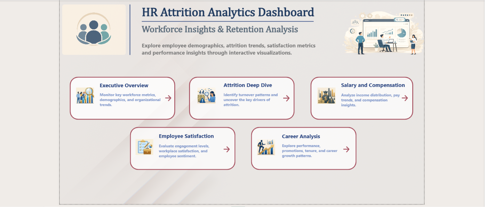
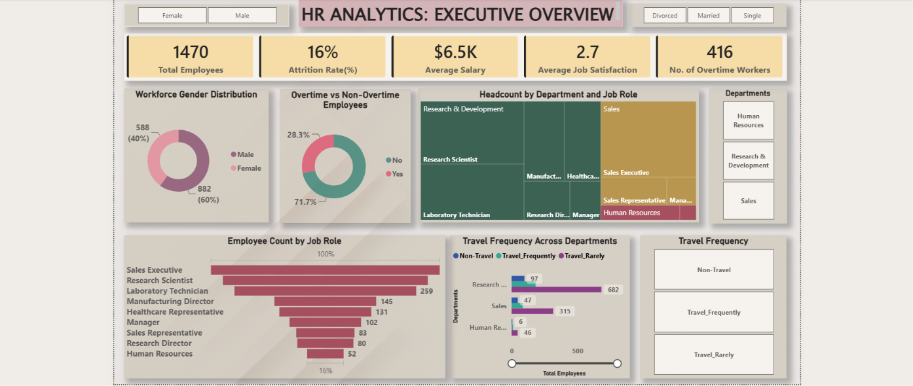
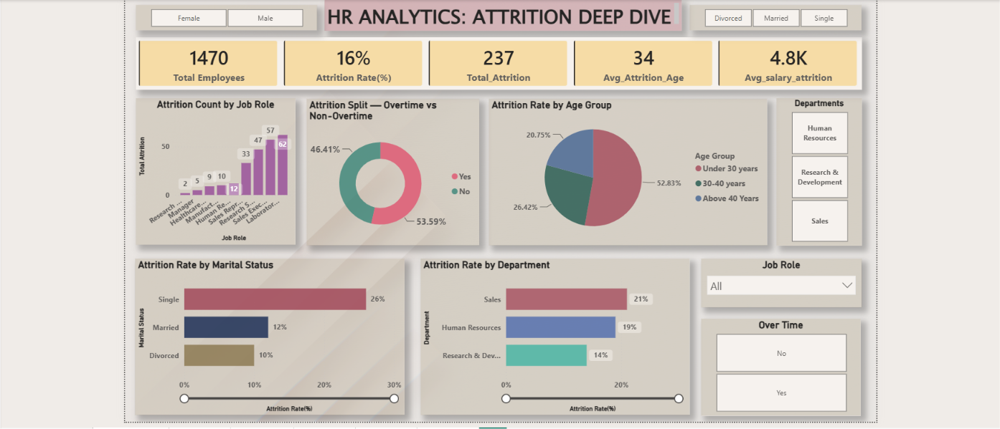
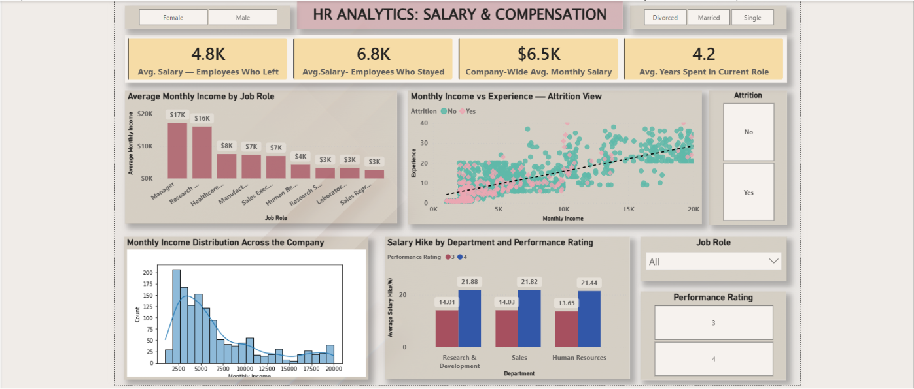
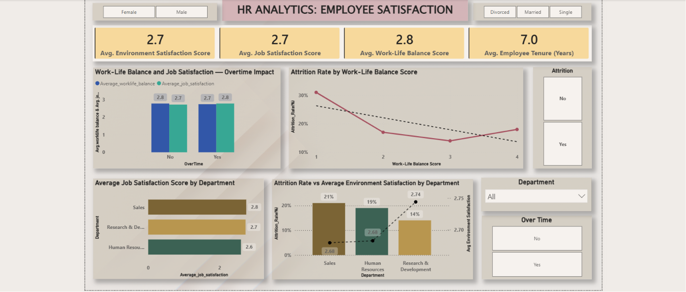
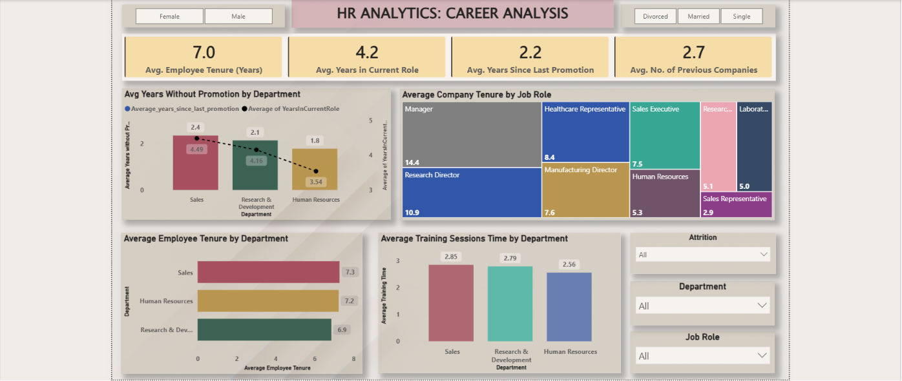

# 📊 HR Analytics: Employee Attrition Analysis & Insights

> An end-to-end data analytics project uncovering why employees leave — using Python, MySQL, and Power BI on the HR Analytics dataset.

---

## 📁 Table of Contents

- [Overview](#overview)
- [Problem Statement](#problem-statement)
- [Dataset](#dataset)
- [Tools Used](#tools-used)
- [Methods](#methods)
- [Key Insights](#key-insights)
- [Dashboard](#dashboard)
- [Results & Conclusions](#results--conclusions)
- [Author & Contact](#author--contact)

---

## 🔍 Overview

This project analyzes employee attrition patterns across a 1,470-employee organization to identify the key drivers of turnover. The analysis covers salary gaps, overtime impact, satisfaction scores, career progression, and demographic trends — all validated with statistical testing and visualized through an interactive Power BI dashboard.

---

## ❓ Problem Statement

The organization has been experiencing employee attrition, which is starting to impact productivity and overall performance. The goal is to understand **why employees are leaving** and **which factors are contributing most** to turnover.

Using the dataset, the analysis examines employee salary, job role, work experience, job satisfaction, and work-life balance to identify patterns behind attrition — and provide clear, data-backed recommendations to improve retention.

---

## 📂 Dataset

| Detail | Info |
|--------|------|
| **Rows** | 1,470 employees |
| **Columns** | 28 features |
| **Target Variable** | `Attrition` (Yes / No) |
| **Type** | Structured, tabular data |

**Key columns used in this analysis:**

`Age` · `Attrition` · `Department` · `JobRole` · `MonthlyIncome` · `OverTime` · `JobSatisfaction` · `EnvironmentSatisfaction` · `WorkLifeBalance` · `YearsAtCompany` · `YearsSinceLastPromotion` · `NumCompaniesWorked` · `MaritalStatus` · `Gender` · `PerformanceRating`

---

## 🛠️ Tools Used

| Tool | Purpose |
|------|---------|
| **Python** (Pandas, NumPy, Matplotlib, Seaborn, SciPy) | Data cleaning, EDA, statistical testing, visualization |
| **MySQL Workbench** | Business query analysis across 20 structured questions |
| **Power BI** | Interactive 5-page dashboard with DAX measures and KPIs |
| **Jupyter Notebook** | Python analysis environment |

---

## ⚙️ Methods

**1. Data Preparation (Python)**
- Loaded and inspected the dataset (shape, dtypes, statistical summary)
- Checked for null values → none found
- Checked for duplicate records → none found
- Exported cleaned data to MySQL using SQLAlchemy

**2. SQL Analysis (MySQL)**
- Wrote 20 business queries across 5 themes: Attrition, Salary & Compensation, Satisfaction & Engagement, Demographics, and Career Growth
- Used `CASE WHEN`, `GROUP BY`, `ROUND`, window aggregations, and conditional counts to extract attrition rates, averages, and segmented comparisons

**3. Exploratory Data Analysis (Python)**
- Created a 9-panel visualization covering attrition by age group, department, job satisfaction, overtime, work-life balance, salary distribution, and employee tenure vs income
- Built a correlation heatmap across all numerical columns

**4. Statistical Testing (Python / SciPy)**
- **Two-Sample T-Test:** Tested whether employees who left earned significantly less than those who stayed → Result: Significant (p < 0.05)
- **One-Way ANOVA:** Tested whether monthly income differs significantly across departments → Result: Significant (p < 0.05)

**5. Dashboard (Power BI)**
- Built a 5-page interactive dashboard covering: Executive Overview, Attrition Deep Dive, Salary & Compensation, Employee Satisfaction, and Career Analysis
- Used DAX measures for dynamic KPIs, slicers for gender/marital status/department/job role, and multiple chart types

---

## 💡 Key Insights

### 🔴 Attrition
- Overall attrition rate is **16.00%** — 237 out of 1,470 employees left
- **Sales** has the highest departmental attrition at **20.63%**
- **Sales Representatives** are the most at-risk job role at **39.76%** attrition
- **Single employees** leave at **25.53%** — nearly 2.5x the rate of divorced employees
- Employees **under 30** have the highest attrition at **26.88%**

### 💰 Salary & Compensation
- Employees who left earned an average of **$4,790/month** vs **$6,830/month** for those who stayed — a $2,000+ gap confirmed statistically (t-test, p < 0.05)
- Monthly income varies significantly across departments (ANOVA, p < 0.05)
- **Sales Representatives earn the least** of all job roles — and also leave the most

### ⏰ Overtime & Workload
- Overtime employees have an attrition rate of **30.53%** — nearly **3x** the rate of non-overtime employees (10.44%)
- Employees with a work-life balance score of **1** have **31% attrition**, dropping to **10%** at score 4

### 😊 Satisfaction & Engagement
- Attrition decreases as job satisfaction increases across all levels
- Employees with environment satisfaction score **1** have **25.35% attrition** vs **13.45%** for score 4
- **5 high-risk employees** score 1 on job satisfaction, environment satisfaction, AND work-life balance simultaneously (4 in R&D, 1 in Sales)

### 📈 Career Growth
- **Sales has the longest average wait for promotion** across all departments
- Employees who have worked at **5+ previous companies** show **25.40% attrition** — the highest among all job-hopping groups
- **Sales Representatives have the lowest average tenure** at just **2.9 years**

---

## 📊 Dashboard

The Power BI dashboard spans 5 pages with dynamic slicers for Gender, Marital Status, Department, Job Role, and Overtime.

### Page 1 — Introduction

### Page 2 — Executive Overview

### Page 3 — Attrition Deep Dive

### Page 4 — Salary & Compensation

### Page 5 — Employee Satisfaction

### Page 6 — Career Analysis

---

## ✅ Results & Conclusions

This project confirmed that employee attrition is not driven by a single factor — it is the result of multiple overlapping pressures acting on specific employee segments.

The most significant findings were:

- **Overtime is the strongest behavioral signal** — employees working overtime leave at nearly 3x the rate of those who don't
- **Salary gaps between leavers and stayers are statistically real** — not just a visual pattern
- **Sales is the most vulnerable department** on every dimension: highest attrition, lowest pay, longest promotion wait, highest role-level turnover
- **Younger and single employees need early engagement** — they leave faster and in larger proportions
- **Work environment and satisfaction scores are leading indicators** — low scores reliably predict higher attrition before it happens

The project demonstrates how combining Python, SQL, and Power BI enables a full-cycle analytics workflow — from raw data to validated insight to visual storytelling.

---

## 👤 Author & Contact

**[Sazzad Soyeb]**

| Platform | Link |
|----------|------|
| 💼 LinkedIn | [Sazzad Soyeb](https://www.linkedin.com/in/sazzadsoyeb/) |
| 🐙 GitHub | [Sazzad-Soyeb-Analytics](https://github.com/sazzad-soyeb-analytics) |
| 📧 Email | sazzadsoyebprof@gmail.com |

---

*If you found this project useful, feel free to ⭐ the repository!*
